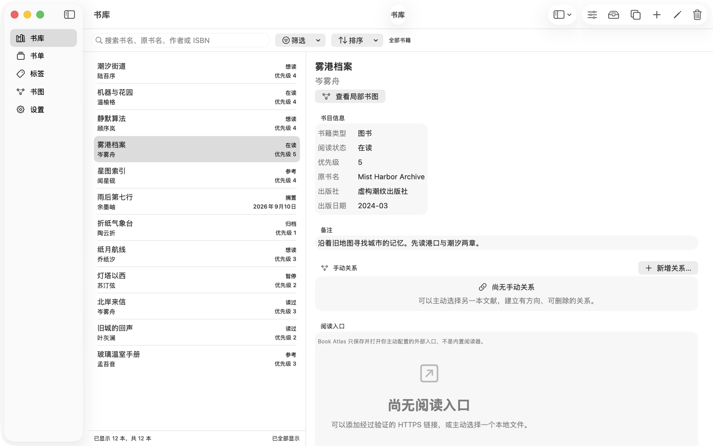
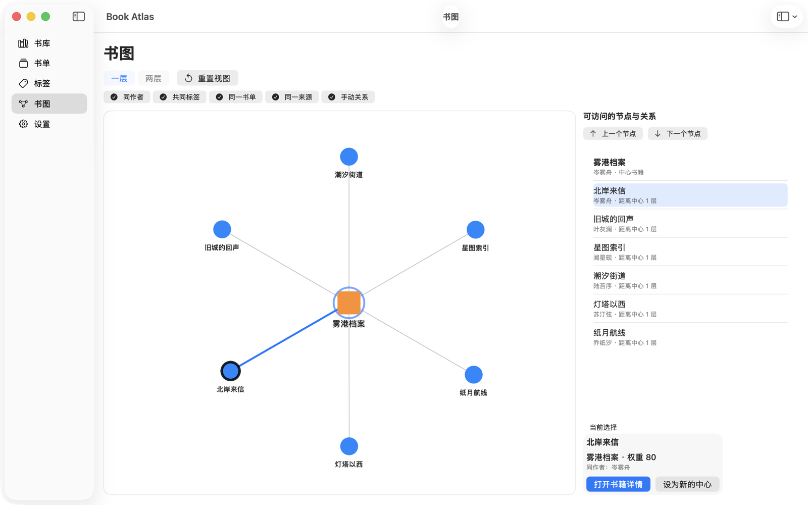

# Book Atlas · 图书志

A native Mac app to organize your books and explore the connections between them.

**[Download v1.2.0](https://github.com/freeforest/book-atlas/releases/download/v1.2.0/BookAtlas-1.2.0.dmg) · Apple Silicon · macOS 26.0+**



Native macOS · Local-first · Offline · No account · No telemetry

*Real app screenshots, using entirely fictional [demo data](SampleData/README.md). The current interface is in Simplified Chinese.*

## Install

No Xcode, Homebrew or development environment required.

**Download → Open DMG → Drag to Applications → Eject → Launch.**

中文：下载安装包 → 打开 DMG → 拖入“应用程序”→ 推出 DMG → 从“应用程序”启动。

The app is **ad-hoc signed, without Developer ID signing or Apple notarization**. Only for an unverified-developer block, and if you trust the official Release source, follow [Apple’s instructions](https://support.apple.com/guide/mac-help/mh40616/mac): **System Settings → Privacy & Security → Open Anyway**. 中文：**系统设置 → 隐私与安全性 → 仍要打开**。

Open Anyway is not available under every policy. For a **damaged app, malware warning or organizational restriction**, stop and report it. Do not disable Gatekeeper or remove quarantine attributes.

Before upgrading, create an in-app full backup, quit the old app completely, then replace it in Applications without deleting its data container.

[Release notes](docs/RELEASE_NOTES-1.2.0.md) · [SHA-256 checksum](https://github.com/freeforest/book-atlas/releases/download/v1.2.0/BookAtlas-1.2.0.dmg.sha256) · [Distribution details](docs/DISTRIBUTION.md)

## A library you can work with

- **Find and organize.** Keep bibliographic details, book types and reading states distinct. Use tags, reading lists and sources alongside search, filters and sorting.
- **Explore connections.** Open a local Book Graph around a book, inspect why its neighbors are connected, and create explicit, directed manual relationships.
- **Resolve duplicates deliberately.** Review explainable candidates and decide whether to merge. Nothing is automatically merged or deleted.
- **Keep your data portable.** Import CSV, export CSV or Markdown, and use full backup and restore with preview and recovery safeguards.
- **Work naturally on macOS.** Keyboard navigation, accessibility support and Light/Dark appearance, built with SwiftUI and AppKit. User-configured links and local-file entries open external destinations; Book Atlas is not an ebook reader or file-content indexer.

## See the relationships in your library



Book Graph is a **bounded local projection of your existing library**. Connections come from shared authors, tags, reading lists, sources, and relationships you explicitly create—not AI recommendations or inferred semantic knowledge.

In this demo, 《雾港档案》 has six neighbors. Selecting 《北岸来信》 reveals their shared author in the explanation panel. The graph and its accessible node list are two views of the same relationships.

## Privacy and data ownership

Your library is stored locally. There is no account, telemetry, cloud sync or application network client. You control imports, exports, backups and file selection.

External reading actions are deliberate: opening a link hands it to another app, which may use the network. Full backups contain your private library and are not encrypted; keep them somewhere safe.

[Privacy](docs/PRIVACY.md) · [Security](SECURITY.md) · [Portability formats](docs/FORMATS/PORTABILITY.md)

## Build from source

Open `BookAtlas.xcodeproj`, select the **BookAtlas** scheme and use a compatible **Xcode 26** toolchain. From the repository root:

```sh
xcodebuild \
  -project BookAtlas.xcodeproj \
  -scheme BookAtlas \
  -configuration Debug \
  -destination 'platform=macOS,arch=arm64' \
  -derivedDataPath /tmp/bookatlas-debug \
  build
```

See [Development](docs/DEVELOPMENT.md) for testing and isolated runs, and [Distribution](docs/DISTRIBUTION.md) for packaging.

The architecture is SwiftUI/AppKit UI → feature stores/catalog → domain model → direct SQLite persistence (Schema 5). Book Graph is derived from library records; it is not a second source of persisted data.

[Product](docs/PRODUCT.md) · [Architecture](docs/ARCHITECTURE.md) · [Data model](docs/DATA_MODEL.md) · [Changelog](CHANGELOG.md)

Development history and verification records are available in the [milestone documentation](docs/PLANS/README.md).

## Contributing and license

See [Contributing](CONTRIBUTING.md) and the [Code of Conduct](CODE_OF_CONDUCT.md). Report security issues through the [private reporting channel](SECURITY.md), and use fictional data in public examples and bug reports.

Released under the [MIT License](LICENSE). Copyright © 2026 FreeForest.
